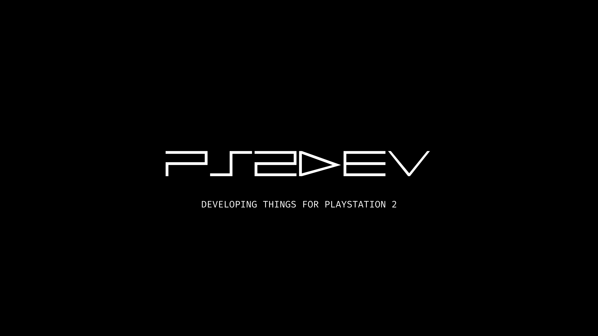

<h1 align="center">PS2 DEV WORLD</h1>

  

This repository aims to bring together “everything” about the game and application development scenario for PlayStation 2. Here you will find all the tools, tutorials (videos), documents, etc. Check it all out below!

## Contents:

- Categories
    - 2D
      - [AthenaEnv](#athenaenv)
    - 3D
      - [PS2GL](#ps2gl)
- [Websites](#websites)
- [YouTube Channels](#youtube)
- [Video Tutorials](#tutorials)
- [Contribute](#contribute)

## AthenaEnv

- [AthenaEnv](https://github.com/DanielSant0s/AthenaEnv)

## PS2GL

- [PS2GL](https://github.com/ps2dev/ps2gl)

## Websites

- [PS2 HOME](https://www.ps2-home.com)
- [PS2DEV FORUMS](https://forums.ps2dev.org)
- [Lukasz.dk](http://www.ps2dev.com)

## YouTube
- [PS2DEV](https://youtube.com/@ps2dev)
- [Guilherme Lampert](https://www.youtube.com/@GuilhermeLampert)
- [Rick Gaiser](https://www.youtube.com/@RickGaiser)
- [Daniel Santos](https://www.youtube.com/@DanielSantosDev)
- [Fatality](https://www.youtube.com/channel/UCCjF3u3eh3NRYOiMdTT7bcQ)
- [Pablo Labs](https://www.youtube.com/@PabloLabs36)
- [Fewnity](https://www.youtube.com/@Fewnity)
- [TyraCraft](https://www.youtube.com/@TyraCraft)

## Tutorials
- [EN - Installation PS2SDK](https://www.youtube.com/watch?v=bsXaR_nWPFY&list=PLeIaNbfDd3faJ6HsjfZfyLgsZLSMcxaUt)
- [PT - Installation PS2SDK](https://www.youtube.com/watch?v=wEVsYnqjOLA&list=PLeIaNbfDd3fYj3fwXQNdg3kCrcYmJIS_A)

## Contribute

Contributions are always welcome!
