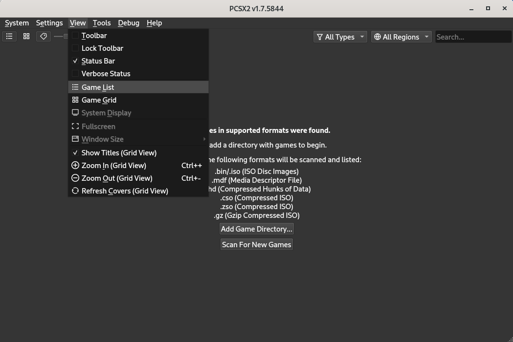
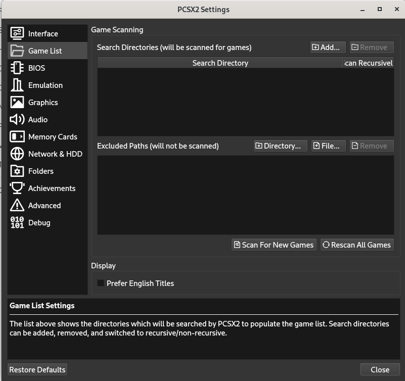
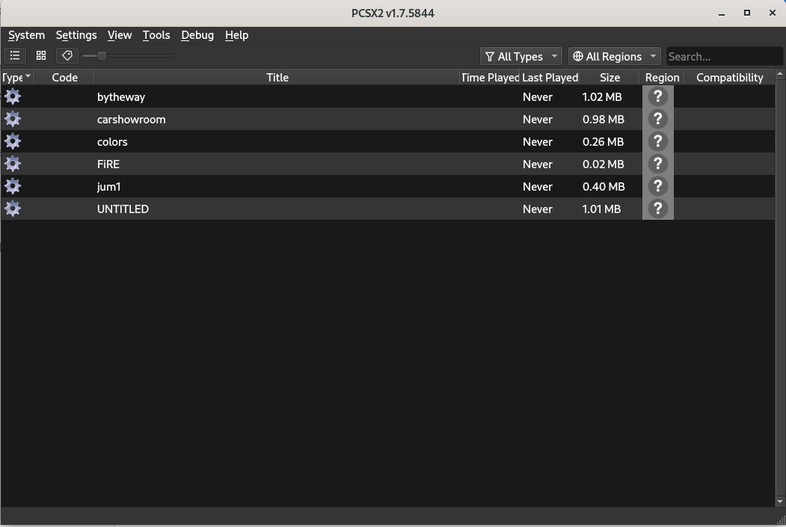

<h1 align="center">PS2 DEV WORLD</h1>

<div align="center">
  
</div>

This repository aims to bring together “everything” about the game and application development scenario for PlayStation 2. Here you will find all the tools, tutorials (videos), documents, etc. Check it all out below!

## Contents:

- Engines
    - [AthenaEnv](#engines)
    - [Tyra](#engines)
    - [Xenity Engine](#engines)
    - [Enceladus](#engines)
    - [PlayLua Engine](#engines)
    - [BennuGD](#engines)
    - [Nichola's PS2 Engine](#engines)
    - [Aionmagan's PS2 Engine](#engines)
    - [RenderWare SDK 3.1](#engines)
- [Websites](#websites)
- [Tools](#tools)
- [Samples](#samples)
- [YouTube Channels](#youtube)
- [Video Tutorials](#tutorials)
- [Documents](#documents)
- [PS2 Code Source Leaked](#ps2-code-source-leaked)
- [Projects](#projects)
- [Contribute](#contribute)

### Engines

1. [AthenaEnv](https://github.com/DanielSant0s/AthenaEnv)
2. [Tyra](https://github.com/h4570/tyra)
3. [Xenity Engine](https://github.com/Fewnity)
4. [Enceladus](https://github.com/DanielSant0s/Enceladus)
5. [PlayLua Engine](https://github.com/cejtok/playluaengine)
6. [BennuGD](https://www.bennugd.org)
7. [Nichola's PS2 Engine](https://github.com/nicholas477/PS2-Engine)
8. [Aionmagan's PS2 Engine](https://github.com/Aionmagan)
9. [RenderWare SDK 3.1](https://archive.org/details/rw310-ps2)

### Websites

1. [PS2 HOME](https://www.ps2-home.com)
2. [PS2DEV FORUMS](https://forums.ps2dev.org)
3. [Lukasz.dk](http://www.ps2dev.com)
4. [PSX PLACE](https://www.psx-place.com)
5. [PlayStation 2 Linux Games Programming - Dr Henry S Fortuna](https://ps2-edu.tensioncore.com/index.html)
6. [PlayStation 2 Linux Community](https://ps2linux.no-ip.info/playstation2-linux.com/index.html)

### Tools

1.  [PCSX2](https://pcsx2.net)
2.  [PS2SDK PORTS](https://github.com/ps2dev/ps2sdk-ports)
3.  [ps2toolchain-ee](https://github.com/ps2dev/ps2toolchain-ee)
4.  [GCC](https://github.com/ps2dev/gcc)
5.  [ps2toolchain-iop](https://github.com/ps2dev/ps2toolchain-iop)
6.  [newlib](https://github.com/ps2dev/fluidsynth)
7.  [FluidSynth](https://github.com/ps2dev/ps2sdk)
8.  [ps2toolchain-dvp](https://github.com/ps2dev/ps2toolchain-dvp)
9.  [ps2dev](https://github.com/ps2dev/ps2dev)
10. [PS2Client](https://github.com/ps2dev/ps2client)
11. [ps2toolchain](https://github.com/ps2dev/ps2toolchain)
12. [binutils-gdb](https://github.com/ps2dev/binutils-gdb)
13. [ps2link](https://github.com/ps2dev/ps2link)
14. [pthread-embedded](https://github.com/ps2dev/pthread-embedded)
15. [GSKIT](https://github.com/ps2dev/gsKit)
16. [ps2-packer](https://github.com/ps2dev/ps2-packer)
17. [ps2gdb](https://github.com/ps2dev/ps2gdb)
18. [ps2gl](https://github.com/ps2dev/ps2gl)
19. [Lua](https://github.com/ps2dev/lua)
20. [mymc](https://github.com/ps2dev/mymc)
21. [ps2stuff](https://github.com/ps2dev/ps2stuff)
22. [lwip](https://github.com/ps2dev/lwip)
23. [PS2ETH](https://github.com/ps2dev/ps2eth)
24. [libtap](https://github.com/ps2dev/libtap)
25. [DKWDRV](https://github.com/DKWDRV)
26. [Next Generation Playstation Development Software GCC Source 0.2.0 - 0.3.0 [PS2]](https://archive.org/details/next-generation-playstation-development-software-gcc-source-0.2.0-0.3.0-ps2)
27. [PlayStation 2 July 2005 SDK (version 3.0.3)](https://archive.org/details/PlayStation2July2005SDKversion3.0.3)

### Samples

1. Download this repository
  ```sh
  git clone https://github.com/playstation2-development/ps2dev-world
  ```
2. Download the [PCSX2](https://pcsx2.net) install and configure in your machine
3. Open the PCSX2 e go to "View" and after that "Game List"

<div align="center">
  
</div>

4. Add the path of the "samples" folder of this repository

<div align="center">
  
</div>

5. Run the sample

<div align="center">
  
</div>

### YouTube
1. [PS2DEV](https://youtube.com/@ps2dev)
2. [Guilherme Lampert](https://www.youtube.com/@GuilhermeLampert)
3. [Rick Gaiser](https://www.youtube.com/@RickGaiser)
4. [Daniel Santos](https://www.youtube.com/@DanielSantosDev)
5. [Fatality](https://www.youtube.com/channel/UCCjF3u3eh3NRYOiMdTT7bcQ)
6. [Pablo Labs](https://www.youtube.com/@PabloLabs36)
7. [Fewnity](https://www.youtube.com/@Fewnity)
8. [Tom Marks Talk Code](https://www.youtube.com/@TomMarksTalksCode)

### Tutorials
1. [EN - Installation PS2SDK](https://www.youtube.com/watch?v=bsXaR_nWPFY&list=PLeIaNbfDd3faJ6HsjfZfyLgsZLSMcxaUt)
2. [PT - Installation PS2SDK](https://www.youtube.com/watch?v=wEVsYnqjOLA&list=PLeIaNbfDd3fYj3fwXQNdg3kCrcYmJIS_A)
3. [Making a PS2 Game](https://www.youtube.com/watch?v=kX_JpzxR2Qg&list=PLFZsvEE0TWOsFhZr-9KwLED3Rzlwra_Rm)

### Documents

1. [PS2 Overview](https://psi-rockin.github.io/ps2tek)
2. [PS2 Architecture](https://www.copetti.org/writings/consoles/playstation-2)
3. [PlayStation 2 Linux Games Programming](https://ps2-edu.tensioncore.com/index.html)
4. [How do Video Game Graphics Work?](https://www.youtube.com/watch?v=C8YtdC8mxTU&t=770s)
5. [PS2 Emotion Engine Library Sample Program Listings](https://archive.org/details/ps-2-emotion-engine-library-sample-program-listings/mode/2up)

### Projects

1. [Cuphead](https://www.youtube.com/@EclipseBladeStudio)
2. [TyraCraft](https://www.youtube.com/@TyraCraft)
3. [Game With Car](https://github.com/freebytego/gwc-ps2)

### PS2 Code Source Leaked

1. [Monsters, Inc. PS2 Source Code And Assets](https://archive.org/details/monstersinc-code-assets)
2. [Extreme G3 Racing PS2 Source Code + PS2 SDK](https://archive.org/details/extreme-g3-racing-source-code)
3. [Outlaw Golf Source Code (Hypnotix)](https://archive.org/details/GOLFCODE)

## Contribute

Contributions are always welcome!

## Credits

Without you all this could not be done:

[Nicholas](https://github.com/nicholas477) - [Fewnity](https://github.com/Fewnity) -
[Daniel Santos](https://github.com/DanielSant0s) - [Aionmagan](https://github.com/Aionmagan) -
[Sandro Sobczyński](https://github.com/h4570) - [PauloDevv](https://github.com/PauloDevv) -
[Lucas Teles](https://github.com/lucasoliveirateles) - [LuanAlcolea](https://github.com/LuanAlcolea) -
[Wellinator](https://github.com/Wellinator) - [Gustavo](https://github.com/GustavoFurtad2) -
[Lucas M. Dutra](https://github.com/terremoth) - [Guilherme Lampert](https://www.youtube.com/@GuilhermeLampert) -
[Tom Marks](https://github.com/phy1um) - [Rick Gaiser](https://github.com/rickgaiser) -
[Francisco Javier Trujillo Mata](https://github.com/fjtrujy) - [Naomi Peori](https://github.com/ooPo) -
[Julian Uy](https://github.com/uyjulian) - [Matías Israelson](https://github.com/israpps) -
[André Guilherme](https://github.com/Wolf3s)

PS: If someone is missing from the list, contact me!